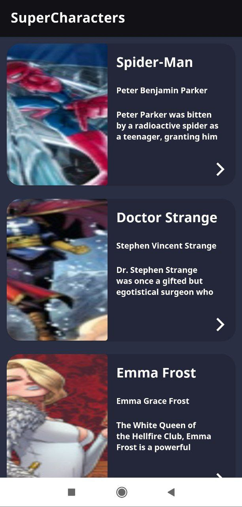

   

# SuperCharacters App (in progress :warning:)

> A simple app to show comics characters using [ComicVine API](https://comicvine.gamespot.com/).

---

# :construction_worker: Setup

* Clone the repo
  * `$ git clone git@github.com:jamilelima/SuperCharacters.git`
* Open the project on android studio
* Build the app
* Enjoy :tada:

# :handshake: Contributing

Feel free to open an [issue](https://github.com/jamilelima/SuperCharacters/issues/new)

# :books: License

Made with :coffee: by [Jamile](https://github.com/jamilelima)
